<h1 align="center">🛠️ Service & Repair Management System</h1>

  

---

## 🚀 Overview

A full-stack web application to manage service requests, inventory, staff, and service providers efficiently.

---

## ✨ Features

- 📦 Item & Inventory Management  
- 🗂️ Category Management  
- 📝 Service Requests  
- 👨‍🔧 Provider Dashboard  
- 👨‍💼 Staff Management  
- 📊 Service Tracking  

---

## ⚙️ Tech Stack

- Frontend: HTML, CSS, Bootstrap  
- Backend: Flask  
- Database: MySQL  

---

## 📱 Application Screenshots

### 🏠 Home Page

  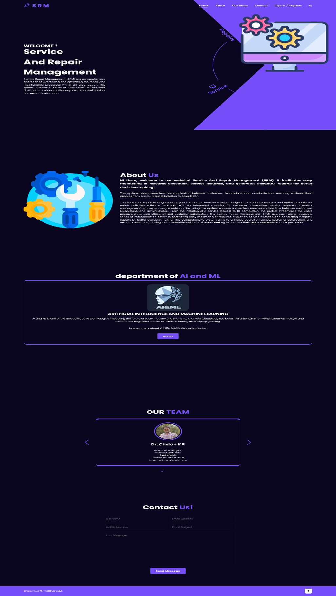

---

### 🔐 Login Page

  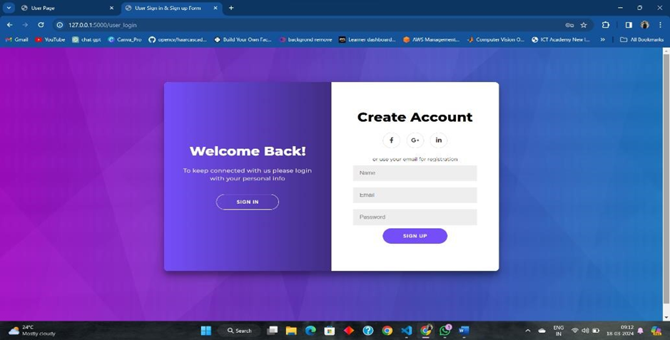

---

### 🏢 Department Management

  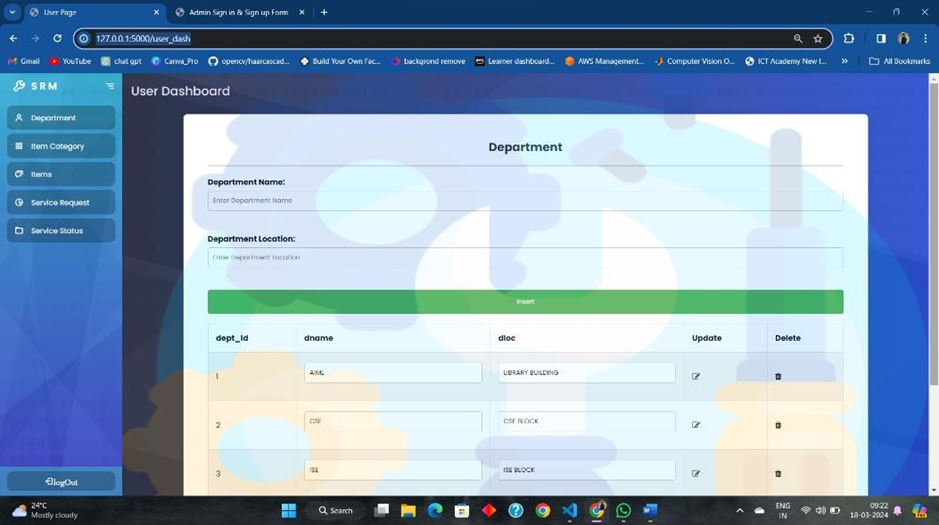

---

### 📂 Category Management

  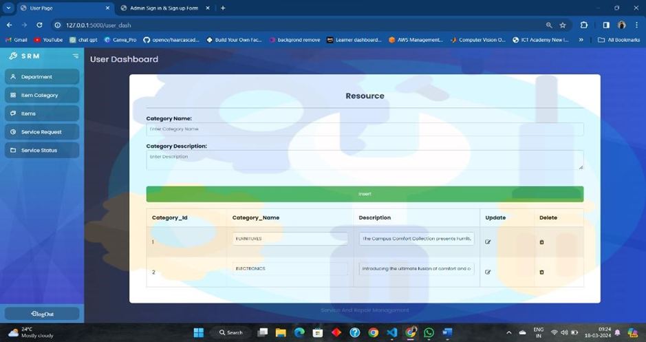

---

### 📦 Item Management

  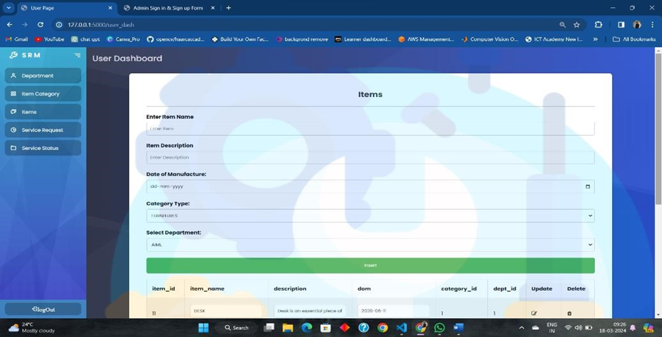

---

### 📝 Service Request

  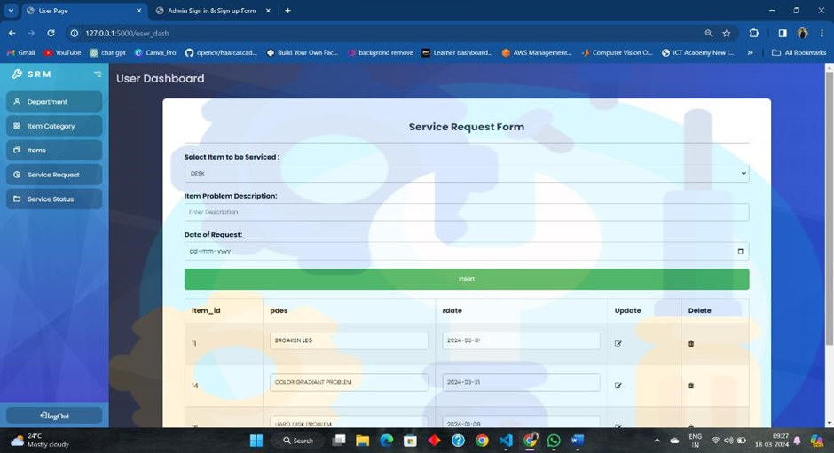

---

### 📊 Service Status

  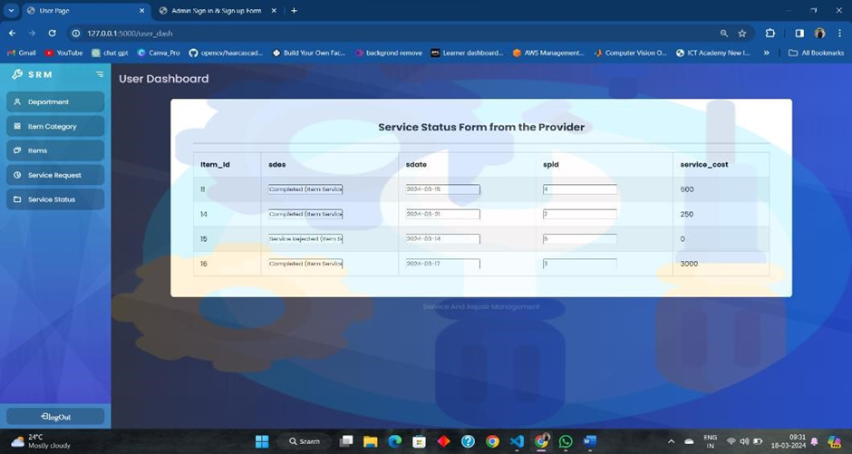

---

### 🔐 Admin Login

  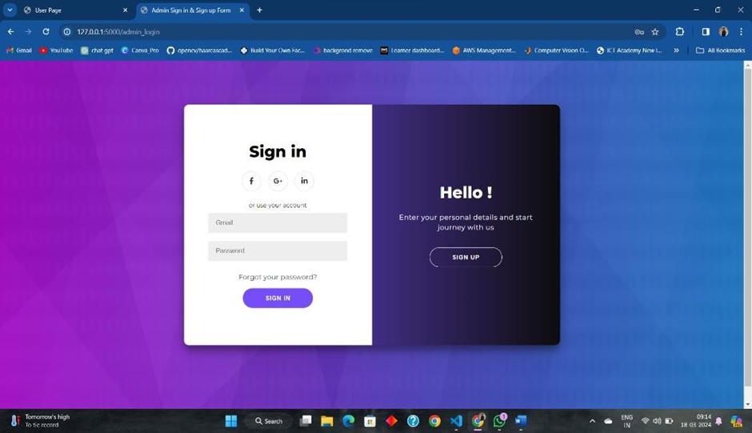

---

### 👨‍🔧 Provider Dashboard

  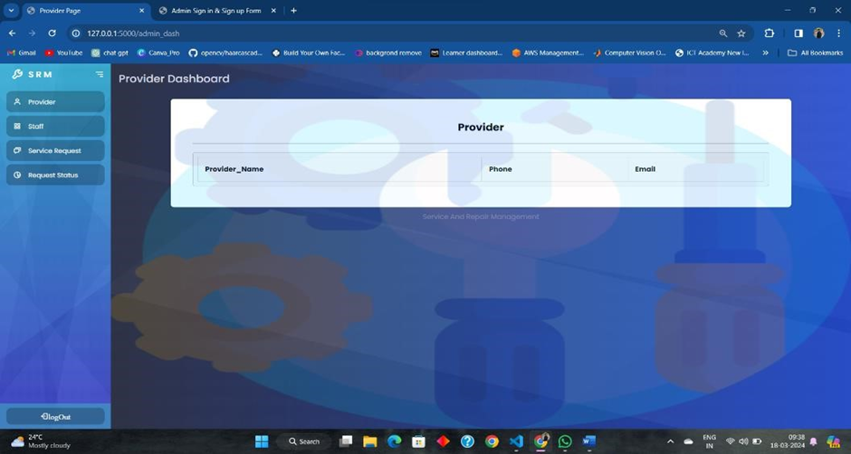

---

### 👨‍💼 Staff Management

  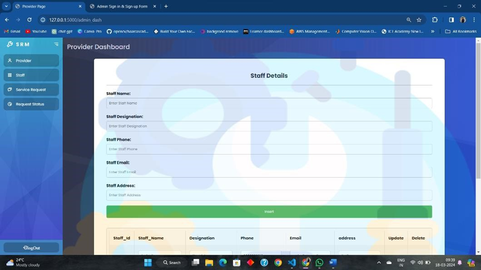

---

### 📥 Provider Requests

  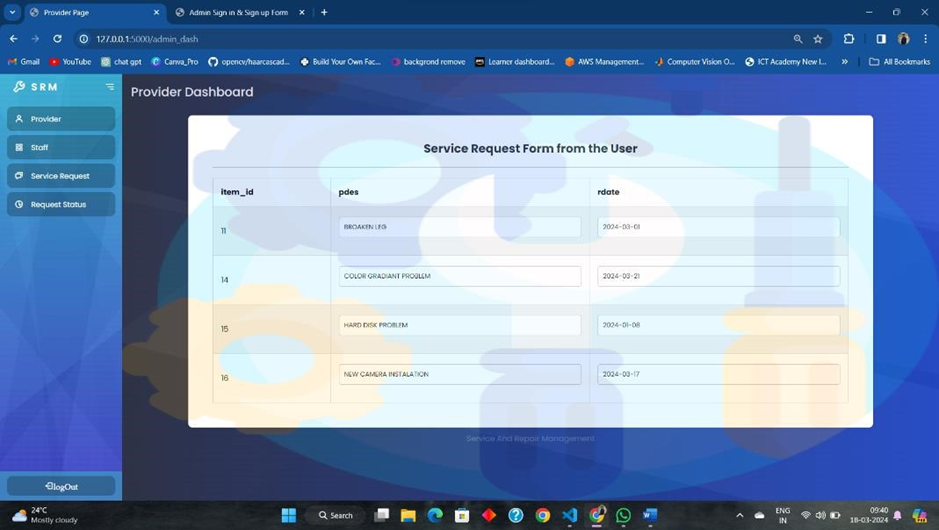

---

### 🔄 Update Service

  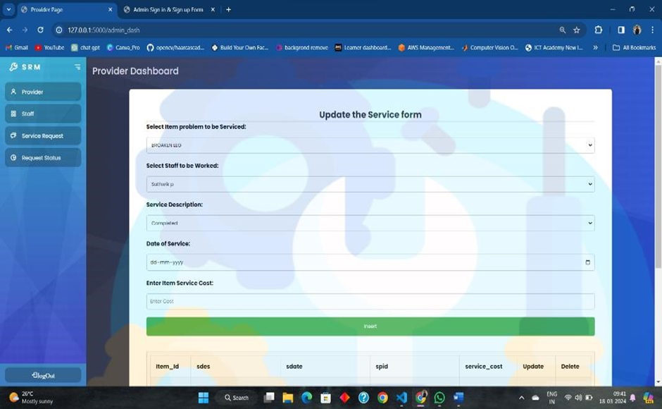

---

## 🗄️ Database Screens

  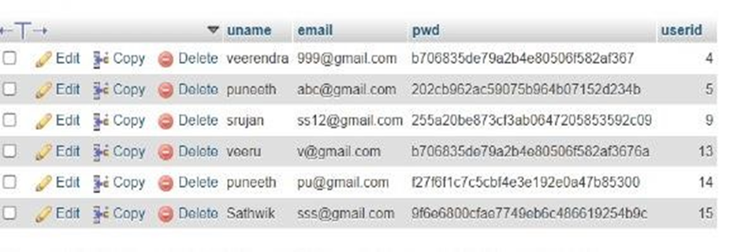
  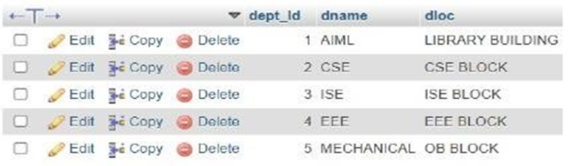

  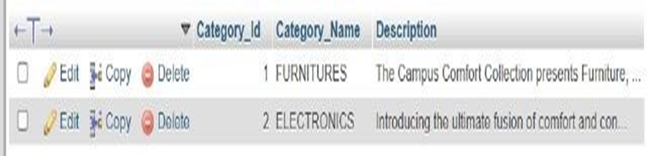
  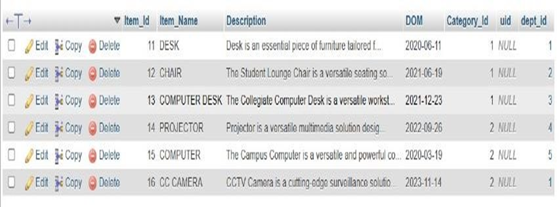

  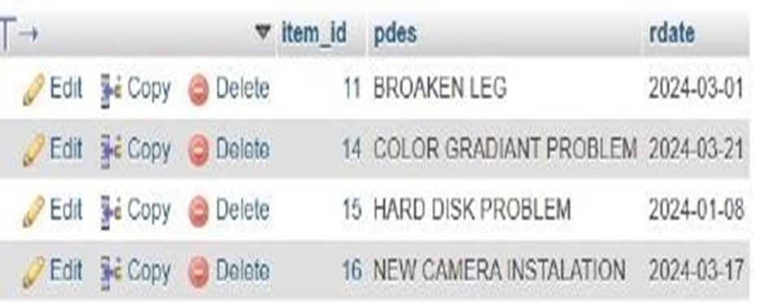

---

## 🎯 Results

- ⏱️ Faster service handling  
- 📊 Better tracking  
- 🔄 Efficient workflow  

---

## 🔮 Future Scope

- 🤖 AI-based prediction  
- 📡 IoT integration  
- 📊 Analytics dashboard  

---

